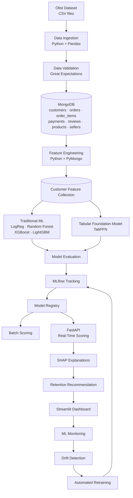

# AI-Based Customer Churn & Retention System

An end-to-end, production-style machine learning system that predicts which e-commerce customers are at risk of churning, explains *why* for each customer, and recommends cost-effective retention actions — wrapped in a full MLOps lifecycle with real-time serving, monitoring, drift detection, and automated retraining.


---

## Overview

Acquiring a new customer costs far more than keeping an existing one, yet most retention effort is spent reactively and uniformly. This project builds a system that turns raw transactional e-commerce data into **per-customer churn risk, explanations, and a prioritized retention plan** — the kind of decision-support tool a growth or CRM team would actually use.

It is built on the [Olist Brazilian E-Commerce dataset](https://www.kaggle.com/datasets/olistbr/brazilian-ecommerce) (~100k orders, 2016–2018) and is designed to be more than a notebook: data is validated and stored in MongoDB, models are tracked and versioned in MLflow, predictions are served in real time through a FastAPI service, and the whole thing is monitored for drift and retrained automatically when performance decays.

### What makes it different

- **Explainable, not just accurate** — every prediction ships with SHAP-based reasons, so a churn score becomes an actionable insight.
- **Decision-focused** — the output is not a probability, it's a *recommended retention action* weighed against its cost.
- **Modern + classical models side by side** — gradient-boosted trees (XGBoost, LightGBM) benchmarked against **TabPFN**, a tabular foundation model, to see where pre-trained tabular models earn their place.
- **Genuine MLOps loop** — training → registry → serving → monitoring → drift detection → automated retraining, not just a saved `.pkl`.

---

## The core modeling challenge: defining churn

Olist is **transactional e-commerce, not a subscription service** — there is no "cancelled" flag, and the large majority of customers place exactly one order. Churn is not a column in the data; it has to be *engineered*.

The key that makes this tractable is the distinction between two identifiers in the `customers` table:

- `customer_id` — a new value for **every order** (order-scoped)
- `customer_unique_id` — a stable value for the **actual person** across orders

Resolving customers to `customer_unique_id` is what surfaces repeat buyers at all. From there, churn is defined as a **labeled prediction problem** over a chosen observation window and a horizon (e.g. *given a customer's behavior up to a cutoff date, will they make no further purchase within the next N days?*). This definition — the window, the horizon, and how one-time buyers are treated — is documented explicitly in the feature engineering module, because it drives every feature and label downstream.

---

## Architecture



---

## Tech stack

| Layer | Tools |
|---|---|
| Language | Python 3.11 |
| Data ingestion & processing | Pandas, PyMongo |
| Data validation | Great Expectations |
| Storage | MongoDB Atlas |
| Modeling | scikit-learn, XGBoost, LightGBM, TabPFN |
| Explainability | SHAP |
| Experiment tracking & registry | MLflow |
| Serving | FastAPI, Uvicorn |
| Dashboard | Streamlit |
| Monitoring & drift | Evidently |
| Packaging & deployment | Docker, GitHub Actions (CI/CD) |

---

## Dataset

[Olist Brazilian E-Commerce Public Dataset](https://www.kaggle.com/datasets/olistbr/brazilian-ecommerce) — real, anonymized orders placed on the Olist marketplace between 2016 and 2018. The raw download is a set of relational CSVs; this project loads seven of them as MongoDB collections:

| Collection | Source file | Description |
|---|---|---|
| `customers` | `olist_customers_dataset.csv` | Customer IDs and location |
| `orders` | `olist_orders_dataset.csv` | Order lifecycle and timestamps |
| `order_items` | `olist_order_items_dataset.csv` | Line items, prices, freight |
| `payments` | `olist_order_payments_dataset.csv` | Payment type, installments, value |
| `reviews` | `olist_order_reviews_dataset.csv` | Review scores and comments |
| `products` | `olist_products_dataset.csv` | Product attributes and category |
| `sellers` | `olist_sellers_dataset.csv` | Seller IDs and location |

> The raw CSVs are not tracked in git. Download them from Kaggle into `data/raw/` before running the ingestion step.

---

## Project structure

```
AI-based-customer-churn-and-retention-system/
├── data/
│   └── raw/                    # Olist CSVs (gitignored)
├── notebooks/                  # EDA, churn-definition exploration, prototyping
├── src/
│   └── churn/
│       ├── config/             # config loading, settings (Mongo URI from .env)
│       ├── ingestion/          # CSV -> MongoDB
│       ├── validation/         # Great Expectations suites
│       ├── features/           # PyMongo feature engineering -> feature collection
│       ├── models/             # train LR/RF/XGB/LGBM + TabPFN, evaluate
│       ├── registry/           # MLflow logging + model registry helpers
│       ├── serving/            # FastAPI app: /predict, /predict/explain
│       ├── explain/            # SHAP + retention recommendation logic
│       ├── monitoring/         # Evidently drift + metrics
│       ├── retraining/         # champion-challenger auto-retraining
│       ├── entity/             # config & artifact dataclasses
│       ├── utils/              # logging, common helpers
│       └── pipeline/           # orchestration (training / batch pipelines)
├── dashboard/                  # Streamlit app
├── tests/
├── .env                        # MONGODB_URI, etc. (gitignored)
├── config.yaml
├── requirements.txt
├── Dockerfile
└── README.md
```

---

## Getting started

### Prerequisites

- Python 3.11+
- A MongoDB Atlas cluster (free tier is enough) and its connection string
- The Olist dataset downloaded into `data/raw/`

### Installation

```bash
# clone
git clone https://github.com/<your-username>/AI-based-customer-churn-and-retention-system.git
cd AI-based-customer-churn-and-retention-system

# create and activate a virtual environment
python -m venv venv
venv\Scripts\activate        # Windows
# source venv/bin/activate   # macOS / Linux

# install dependencies
pip install -r requirements.txt
```

### Configuration

Create a `.env` file in the project root:

```env
MONGODB_URI="your-mongodb-atlas-connection-string"
MONGODB_DB="churn_db"
```

---

## Usage

> Commands are indicative of the intended pipeline; individual stages are added as the project progresses (see the roadmap below).

```bash
# 1. Load the Olist CSVs into MongoDB
python -m src.churn.pipeline.ingest

# 2. Validate the ingested data
python -m src.churn.pipeline.validate

# 3. Build customer-level features
python -m src.churn.pipeline.build_features

# 4. Train and evaluate models (tracked in MLflow)
python -m src.churn.pipeline.train

# 5. Serve real-time predictions
uvicorn src.churn.serving.app:app --reload

# 6. Launch the dashboard
streamlit run dashboard/app.py
```

---

## Roadmap

- [ ] **Foundation** — repo structure, environment, dataset, MongoDB connection
- [ ] **Data ingestion** — Olist CSVs → MongoDB collections
- [ ] **Data validation** — Great Expectations suites and quality gates
- [ ] **Churn definition** — observation window, horizon, and label logic
- [ ] **Feature engineering** — RFM, tenure, review, payment & delivery features → feature collection
- [ ] **Modeling** — LogReg / Random Forest / XGBoost / LightGBM baselines + TabPFN
- [ ] **Evaluation & tracking** — metrics, comparison, MLflow experiments
- [ ] **Model registry** — versioning and stage promotion (Staging → Production)
- [ ] **Serving** — FastAPI `/predict` and `/predict/explain` endpoints
- [ ] **Explainability & retention** — SHAP reasons + cost-aware action recommendations
- [ ] **Dashboard** — Streamlit interface for risk, drivers, and recommendations
- [ ] **Monitoring & drift** — Evidently reports and alerts
- [ ] **Automated retraining** — champion–challenger loop with MLflow promotion
- [ ] **Deployment** — Docker + CI/CD

---

## Results

_Model performance, comparison tables, and dashboard screenshots will be added here as the modeling and serving stages are completed._

---

## Author

**Shourya Chauhan** — B.Tech Computer Science & Engineering
- GitHub: [@your-username](https://github.com/your-username)
- LinkedIn: [your-profile](https://linkedin.com/in/your-profile)

---

## License

This project is licensed under the MIT License — see the [LICENSE](LICENSE) file for details.

## Acknowledgements

- [Olist](https://olist.com/) and Kaggle for the public Brazilian e-commerce dataset.
- The open-source maintainers of scikit-learn, XGBoost, LightGBM, TabPFN, MLflow, SHAP, FastAPI, Streamlit, and Evidently.
